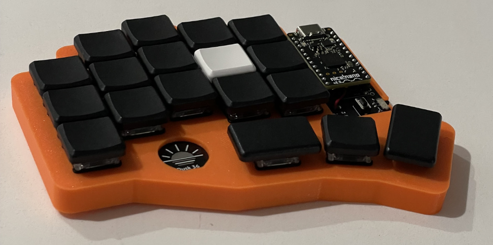

<h1 align="center">Dusk 36 Keyboard</h1>

Dusk 36 is a 36-key low-profile split ergo keyboard based off https://github.com/weteor/3W6 and 
https://github.com/davidphilipbarr/Sweep.

The Dusk 36 is designed around the nice!nano v2.0 microcontroller in order to be a true wireless keyboard (no cables
between halves or from the keyboard to the computer). This board's layout was generated with 
[my fork of Ergogen](https://github.com/daveallie/ergogen/tree/daveallie-improvements) (which includes a few small 
changes), and then routed by hand in KiCad.

### PCB Preview

| Left                   | Right                   |
|------------------------|-------------------------|
|  |  |

### BOM

**Hardware for PCB**
- 2 x [nice!nano v2.0](https://keebd.com/products/nice-nano?variant=41688983240856)
- 1 x [Kailh Low Profile Switches Hot-swappable PCB Socket Sip socket Hot Plug (50 pack)](https://www.aliexpress.com/item/1005003575767699.html)
- 2 x [40 Pin Machined IC Breakable Female Header Strip](https://keebd.com/products/40-pin-machined-ic-breakable-female-header-strip?variant=40383060410520)
- Pins (pick one)
  - 48 x [Single Post Terminal Connector Through Hole Gold 0.020" (0.51mm) Dia](https://www.digikey.com.au/en/products/detail/mill-max-manufacturing-corp/3320-0-00-15-00-00-03-0/4147392)
  - 2 x [Mill-Max Low Profile Controller Pins (Pack of 25)](https://keebd.com/products/mill-max-low-profile-controller-pins-pack-of-25?variant=41055232458904)
- 2 x [EG1215AA Switch](https://www.digikey.com.au/en/products/detail/e-switch/EG1215AA/9559277)
- 2 x [PTS636 SK43 LFS button](https://www.digikey.com.au/en/products/detail/c-k/PTS636-SK43-LFS/10071716)
- 2 x [Polymer Lithium Ion Battery (LiPo) 3.7V 120mAh](https://core-electronics.com.au/lipo-polymer-lithium-ion-battery-120mah.html)
- 36 x SOD-123 diode

**Switches and Keycaps**
- 4 x [Kailh low profile Switch 1350 Chocolate Keyboard Switch RGB SMD kailh Mechanical Keyboard white stem clicky hand feeling (10 pack)](https://www.aliexpress.com/item/32959996455.html)
- 3 x [MBK Low Profile Keycaps - 1u Black (10 pack)](https://keebd.com/products/mbk-low-profile-keycaps?variant=41506944909464)
- 1 x [MBK Low Profile Keycaps - 1u Homing White (2 pack)](https://keebd.com/products/mbk-low-profile-keycaps?variant=41506944811160)
- 1 x [MBK Low Profile Keycaps - 1.5u Black (5 pack)](https://keebd.com/products/mbk-low-profile-keycaps?variant=41506944975000)
